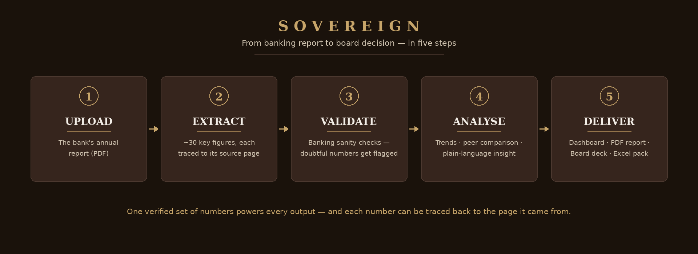

# Sovereign — Banking Annual Report Intelligence Platform



Built for **Indian banks**: transforms unstructured banking documents (annual
reports, Basel III Pillar 3 disclosures, ESG/BRSR reports) into a validated KPI warehouse, peer benchmarking, executive
narrative, an interactive dashboard, and boardroom-ready deliverables
(PDF report, PowerPoint deck, Excel data pack).

**Document → Data → Analytics → Insight → Decision** — not document → AI summary.
Extraction, validation, derivation, benchmarking and narrative are all
deterministic and fully traceable: every number on every surface carries
lineage (source document, page, extraction method, confidence).

## Architecture (modular product, not project)

| Module | Location | Responsibility |
|---|---|---|
| Document Intelligence | `backend/app/modules/document_intelligence/` | PDF → candidates (table + rule-based extractors, pluggable LLM seam) → resolved facts with lineage |
| KPI Warehouse | `backend/app/modules/kpi_warehouse/` | KPI registry (single source of KPI semantics), calculation engine, query layer |
| Validation Engine | `backend/app/modules/validation/` | Banking-specific structural, consistency and plausibility rules |
| Benchmarking Engine | `backend/app/modules/benchmarking/` | Peer ranking, percentiles, distribution stats |
| Narrative Engine | `backend/app/modules/narrative/` | Deterministic consulting-grade commentary & recommendations |
| Export Engine | `backend/app/modules/export/` | Excel / PPTX / PDF — all reading the same warehouse services |
| Dashboard | `frontend/` | Next.js executive dashboard ("Old Money" design system) |

See `docs/ARCHITECTURE.md` for design decisions and `docs/API_CONTRACT.md`
for the HTTP contract between frontend and backend.

## Quick start

Backend (Python 3.11+):

```bash
cd backend
python -m venv .venv && .venv/bin/pip install -e ".[dev]"   # or: uv venv && uv pip install -e ".[dev]"
.venv/bin/uvicorn app.main:app --reload --port 8000
```

First boot creates a SQLite database and seeds four synthetic demo Indian banks ×
three fiscal years (clearly flagged `is_demo`). Set
`SOVEREIGN_DATABASE_URL=postgresql+psycopg://...` for PostgreSQL and
`SOVEREIGN_SEED_DEMO_DATA=false` to disable seeding. API docs: http://localhost:8000/docs

Frontend (Node 20+):

```bash
cd frontend
npm install
npm run dev   # http://localhost:3000
```

## Try the full pipeline

Generate a synthetic annual report PDF and upload it through the dashboard's
Documents page (or `POST /api/documents/upload`):

```bash
cd backend && .venv/bin/python scripts/make_sample_pdf.py
```

Watch extraction → unit normalisation → derived KPIs → validation run, then
open the bank's dashboard for the new fiscal year and download the exports
from the Reports page.

## Persistent storage with Supabase (or any PostgreSQL)

By default Sovereign uses a local SQLite file. To keep uploaded data
permanently in the cloud, point it at a Supabase project (Supabase is
hosted PostgreSQL — the backend supports it natively):

```bash
cd backend && .venv/bin/pip install -e ".[postgres]"   # psycopg driver, once

# Supabase dashboard → Project Settings → Database → Connection string (URI).
# Replace the postgres:// prefix with postgresql+psycopg://
export SOVEREIGN_DATABASE_URL="postgresql+psycopg://postgres.<ref>:<PASSWORD>@aws-0-<region>.pooler.supabase.com:5432/postgres"
.venv/bin/uvicorn app.main:app --reload --port 8000
```

First boot creates all tables and seeds the Indian roster + demo banks in
Supabase; everything you upload persists across restarts, upgrades and
machines. (Version upgrades that change the schema need a migration or a
fresh database — SQLite's delete-to-reseed shortcut also applies here only
if you accept losing data.)

## Optional: local LLM fallback with Ollama (great on a MacBook)

The deterministic extractors handle standard annual reports on their own. For
exotic layouts you can enable the LLM fallback against a **local** model — no
API key, fully offline, same trust rules (page + verbatim quote required,
confidence capped below deterministic extraction):

```bash
brew install ollama            # macOS
ollama serve                   # or: brew services start ollama
ollama pull llama3.1:8b

export SOVEREIGN_LLM_EXTRACTION_ENABLED=true
export SOVEREIGN_LLM_PROVIDER=ollama
# optional: SOVEREIGN_LLM_MODEL=llama3.1:8b  SOVEREIGN_OLLAMA_BASE_URL=http://localhost:11434
.venv/bin/uvicorn app.main:app --reload --port 8000
```

**Using GLM instead:** two ways.
Local GLM on Apple Silicon (free, offline): `ollama pull glm4` then set
`SOVEREIGN_LLM_PROVIDER=ollama SOVEREIGN_LLM_MODEL=glm4` (~6 GB RAM; on an
8 GB Mac prefer the cloud route). Zhipu GLM cloud API:

```bash
export SOVEREIGN_LLM_EXTRACTION_ENABLED=true
export SOVEREIGN_LLM_PROVIDER=openai_compatible
export SOVEREIGN_LLM_BASE_URL=https://open.bigmodel.cn/api/paas/v4
export SOVEREIGN_LLM_API_KEY=<your GLM key>
export SOVEREIGN_LLM_MODEL=glm-4-flash        # or glm-4-plus
```

The `openai_compatible` provider works with any /chat/completions endpoint.
To use Claude instead: `pip install -e ".[llm]"`, set `ANTHROPIC_API_KEY`,
and leave `SOVEREIGN_LLM_PROVIDER=anthropic`. All knobs are documented in
`backend/.env.example`.

## Tests

```bash
cd backend && .venv/bin/python -m pytest        # 27 tests incl. PDF→export E2E
cd frontend && npm run build                    # type-check + production build
```
